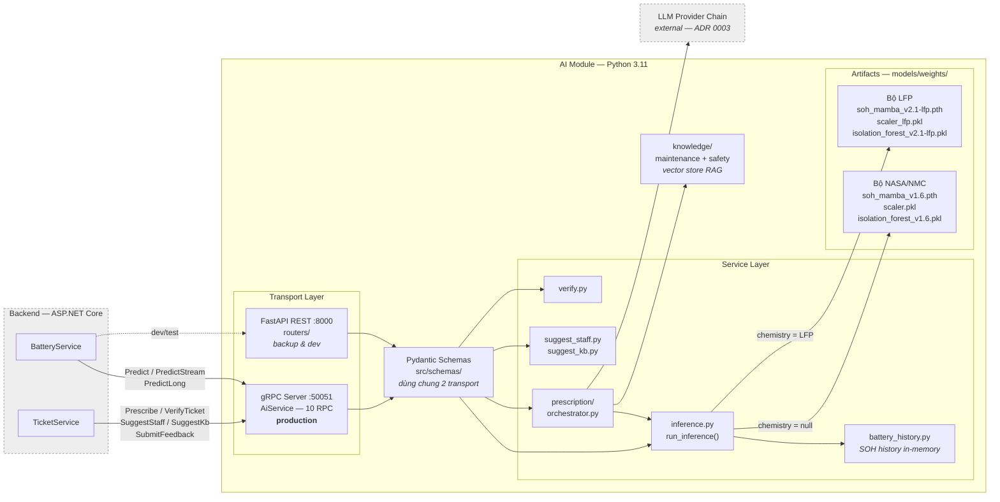
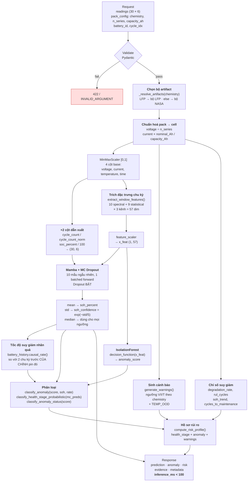
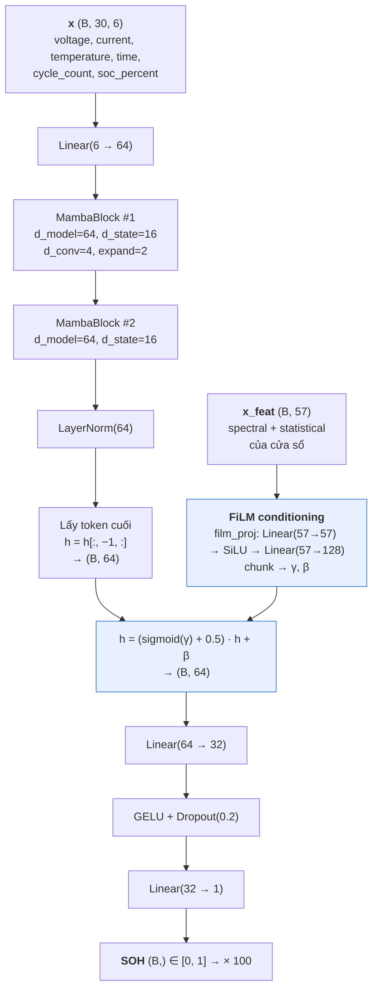
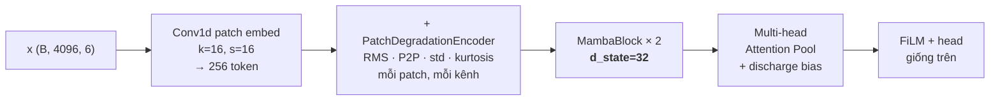

# Diagram — AI Module (GSU26SE55)

> Nguồn sự thật: code trong repo này. Mỗi diagram ghi rõ file gốc để đối chiếu khi code đổi.
> Render: GitHub tự render Mermaid. Export ảnh chèn Word: dán code vào https://mermaid.live → Export PNG/SVG.

**Trạng thái:** 3/10 diagram. Còn lại: Data pipeline, Training, Sequence, Decision logic, Artifact map, RAG, Feedback loop.

---

## 1. Component Diagram — AI module trong hệ thống

Nguồn: [main.py](../main.py) · [src/grpc_server.py](../src/grpc_server.py) · [src/routers/](../src/routers/) · [protos/ai_service.proto](../protos/ai_service.proto)

**Điểm cần nói trong báo cáo:**
- AI module **stateless** — không có database quan hệ, chỉ có in-memory SOH history
- Một pipeline, hai transport — gRPC và REST gọi chung `run_inference()`, không duplicate logic
- Validate input bằng **cùng một** Pydantic schema → hai transport reject giống hệt nhau
- Port 50051 **không** expose ra ngoài Docker network

---

## 2. Inference Pipeline — chi tiết box `run_inference()`

Nguồn: [src/services/inference.py:278-460](../src/services/inference.py#L278) · [src/features/extractor.py](../src/features/extractor.py)

**Điểm cần nói trong báo cáo:**
- Chọn bộ artifact **trước tiên** — để scaler, model, iforest và hằng số chuẩn hoá không bao giờ lệch bộ
- Quy đổi pack → cell **trước** scaler — pack 8S/24V được chấm điểm trên phân phối cell mà model đã học
- MC Dropout 10 mẫu chạy **1 lần forward theo batch**, không phải vòng lặp — đây là lý do đạt được <100ms
- Ngưỡng quyết định dùng **median**, số báo cáo dùng **mean** — median chống nhiễu khi n=10
- IsolationForest chấm điểm trên **57 chiều đặc trưng**, không phải trên chuỗi thô

---

## 3. Model Architecture — MambaSOHPredictor

Nguồn: [src/models/soh_predictor.py:342-500](../src/models/soh_predictor.py#L342)

**Biến thể long-sequence (L=4096)** — dùng cho `PredictLong`, không phải đường production:

**Điểm cần nói trong báo cáo:**
- **Pure PyTorch** — không dùng thư viện CUDA `mamba-ssm`, chạy được Windows native. Có nhánh opt-in dùng kernel CUDA trên Kaggle/Colab, cùng công thức toán, chỉ nhanh hơn
- **FiLM conditioning** là điểm khác biệt so với Mamba gốc: đặc trưng phổ cấp chu kỳ (57 chiều) điều biến trạng thái ẩn thay vì nối vào input
- Đường production (L=30) dùng `d_state=16` + pooling "last"; đường long-seq dùng `d_state=32` + attention pooling — **hai cấu hình khác nhau, đừng vẽ chung một hình**

---

## Còn lại (chưa vẽ)

| # | Diagram | Nguồn |
|---|---------|-------|
| 4 | Data pipeline / Preprocessing | `scripts/preprocess.py`, `preprocess_lfp.py`, `preprocess_snl.py` |
| 5 | Training pipeline | `scripts/train.py` |
| 6 | Sequence — BE ↔ AI (Predict, Prescribe, VerifyTicket) | `src/grpc_server.py`, `protos/ai_service.proto` |
| 7 | Decision logic flowchart | `src/models/anomaly_detector.py` |
| 8 | Model artifact / versioning map | `src/core/config.py`, `src/core/model_loader.py` |
| 9 | RAG pipeline | `src/services/prescription/`, `scripts/ingest_rag.py` |
| 10 | Feedback loop | `src/services/classification_feedback.py`, `prescription/history_store.py` |
