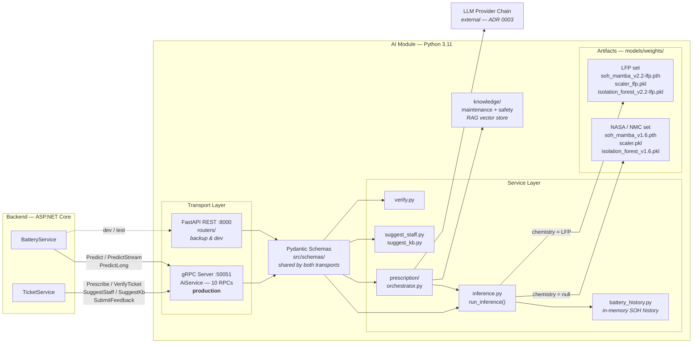
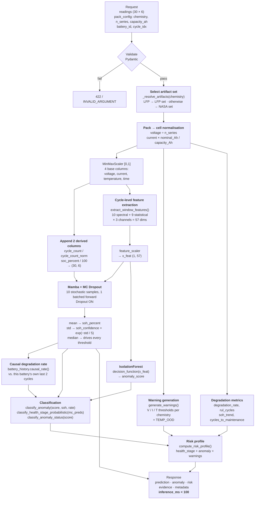
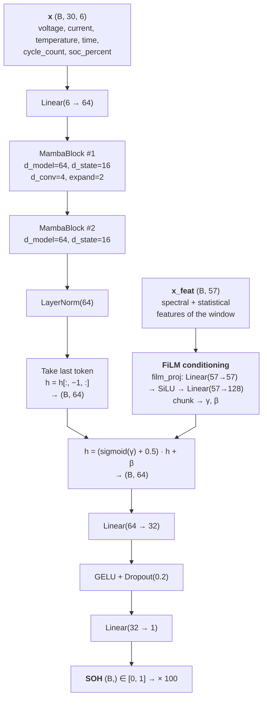
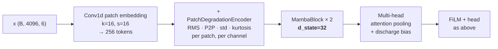

# Diagrams — AI Module (GSU26SE55)

> Source of truth: the code in this repository. Each diagram lists its source files so it can be re-verified when the code changes.
> Rendering: GitHub renders Mermaid natively. To export an image for the report, paste a block into [mermaid.live](https://mermaid.live) → Export PNG/SVG.

**Status:** 3 of 10 complete. Remaining: Data pipeline, Training, Sequence, Decision logic, Artifact map, RAG, Feedback loop.

---

## 1. Component Diagram — AI Module in the system

Source: [main.py](../main.py) · [src/grpc_server.py](../src/grpc_server.py) · [src/routers/](../src/routers/) · [protos/ai_service.proto](../protos/ai_service.proto)

**Points to make in the report:**

- The AI module is **stateless** — no relational database, only an in-memory SOH history keyed by battery.
- One pipeline, two transports — gRPC and REST both call `run_inference()`; the logic is never duplicated.
- Input is validated by the **same** Pydantic schema on both paths, so both transports reject identical payloads.
- Port 50051 is **not** exposed outside the Docker network.

---

## 2. Inference Pipeline — inside `run_inference()`

Source: [src/services/inference.py:278-460](../src/services/inference.py#L278) · [src/features/extractor.py](../src/features/extractor.py)

**Points to make in the report:**

- The artifact set is chosen **first**, so the scaler, the model, the Isolation Forest and the normalisation constants can never come from different sets.
- Pack-to-cell conversion happens **before** the scaler, so an 8S / 24 V pack is scored against the per-cell distribution the model was trained on.
- MC Dropout draws 10 samples in **a single batched forward pass**, not a Python loop — this is what keeps the pipeline under 100 ms.
- Threshold decisions use the **median**; the reported figure is the **mean**. The median resists outliers when n = 10.
- The Isolation Forest scores the **57-dimensional feature vector**, not the raw sequence.

---

## 3. Model Architecture — MambaSOHPredictor

Source: [src/models/soh_predictor.py:342-500](../src/models/soh_predictor.py#L342)

**Long-sequence variant (L = 4096)** — used by `PredictLong`, not by the production path:

**Points to make in the report:**

- **Pure PyTorch** — the `mamba-ssm` CUDA library is not required, so the model runs natively on Windows. An opt-in flag switches to the CUDA kernel on Kaggle/Colab: identical mathematics, only faster.
- **FiLM conditioning** is the departure from vanilla Mamba: the 57-dimensional cycle-level spectral features modulate the hidden state rather than being concatenated to the input.
- The production path (L = 30) uses `d_state=16` with last-token pooling; the long-sequence path uses `d_state=32` with attention pooling. These are **two distinct configurations and must not be drawn as one figure**.

---

## Remaining diagrams

| # | Diagram | Source |
|---|---------|--------|
| 4 | Data pipeline / preprocessing | `scripts/preprocess.py`, `preprocess_lfp.py`, `preprocess_snl.py` |
| 5 | Training pipeline | `scripts/train.py` |
| 6 | Sequence — BE ↔ AI (Predict, Prescribe, VerifyTicket) | `src/grpc_server.py`, `protos/ai_service.proto` |
| 7 | Decision logic flowchart | `src/models/anomaly_detector.py` |
| 8 | Model artifact / versioning map | `src/core/config.py`, `src/core/model_loader.py` |
| 9 | RAG pipeline | `src/services/prescription/`, `scripts/ingest_rag.py` |
| 10 | Feedback loop | `src/services/classification_feedback.py`, `prescription/history_store.py` |
